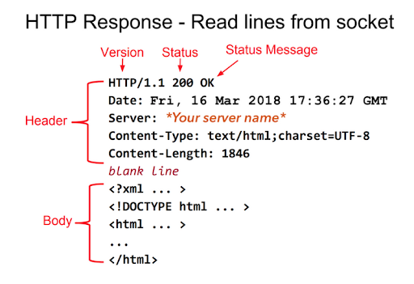

# webserv
<h2>Some references before starting the project </h2> (better go through this list by order)
<ol>
<li>
    <a href="https://www.youtube.com/watch?v=e4S8zfLdLgQ">
        General understanding on OSI model
    </a>
</li>
<li>
    <a href="https://www.youtube.com/watch?v=e4S8zfLdLgQ">
        How website works - part 1/2: 
    </a>Frontend, request, response, header, HTTP's methods
</li>
<li>
    <a href="https://www.youtube.com/watch?v=FTAPjr7vgxE">
        How website works - part 2/2: 
    </a>web server, backend
</li>
<li>
    <a href="https://medium.com/from-the-scratch/http-server-what-do-you-need-to-know-to-build-a-simple-http-server-from-scratch-d1ef8945e4fa">
        How to Build a simple HTTP server from scratch (using C)
    </a>
</li>
</ol>

<h2>Quelque idée sur le projet</h2>

En gros webserv c’est un minishell le bail.
Sauf qu’au lieu de parser des commandes tu parses des requetes web. 
Tu vas recevoir un truc sur un fd (socket), le lire, puis le parser.

 
Le projet peut être découpé assez simplement :
 
<h3>1. Réseau</h3>

Il y a toute une partie orchestration des connections, où il faut jongler avec les fd, qui lire, sur qui écrire, et comment gérer l’availabiliy.  
On peut faire comme le lien "How to buil HTTP...from scratch".   
Après il faudra que tu fasses un client pour tester, ou que tu testes avec curl.   
Et derrière faut que t’étoffes en rendant chaque socket connectable avec select (qui est justement un gestionnaire de fd).  

Le browser va sortir pour nous une requête automatiquement comme ça.   
</img>

 
En gros :  
Tu crées une socket en spécifiant host 10.24.3.23 et port 8080.  
T’obtiens ton FD associé.  
Maintenant si tu fais un “curl 10.24.3.23:8080” tu recevras la requête sur le FD et tu pourras la read()  
Idem si tu vas dans google à l’adresse http://10.24.3.23:8080, ton browser va envoyer une requete GET à ce host:port que tu pourras read() sur le FD.  
Après avoir fait curl, tu fais read(), et là c'est la partie parsing commence.  

 
<h3>2. Parsing</h3>
Le parsing de la requête (grosse partie, je conseille de charger le moins possible la personne qui s’en occupe) - il s’agit de bien lire la requête pour comprendre ce que veut le user.  
 
Et en gros le parsing va ressortir trois infos  
1 - La méthode (donc en gros ce que le mec veut faire) : GET pour lire, PUT pour écrire, etc  
2 - Les headers, une liste d’infos qui vont changer (ou non) ce que tu renvoies  
3 - Le body, un bout de texte optionnel, qui contiendrait par exemple la page que l’utilisateur veut PUT dans le cas d’un PUT  
 
Dans cette partie, il faut sortir un reponse du même HTTP protocol, comme ça 
</img>  
Après tu l'envois ver le même fd. 
Et le taff de browser c'est lire le reponse qu'on l'a envoyé et afficher le fichier hello.html.  
 
<h3>3. Autres</h3>
Config : le programme aura un fichier de config qui changera son comportement en fonction de l’url, du serveur appelé, etc  
 
CGI : il faut aussi gérer la CGI (appel avec execve d’un éxecutable externe, puis renvoi de l’output de ce dernier, PHP par exemple)  
 
A priori je dirais un sur le réseau, un sur le parsing, un sur le reste. Avec le troisième qui aide au parsing